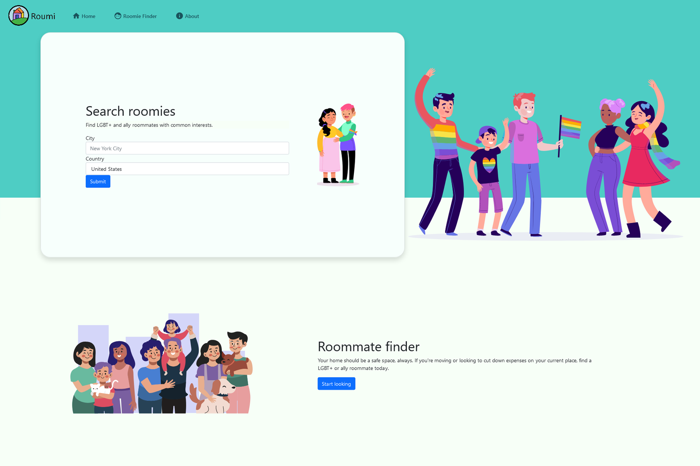
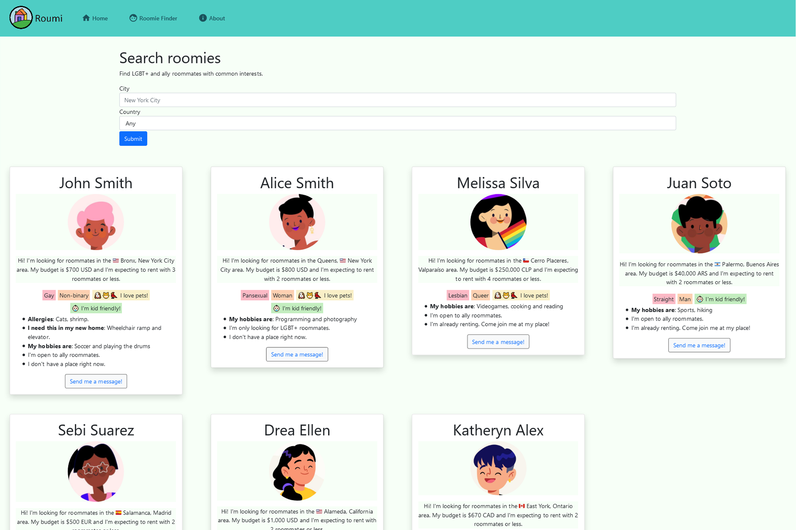

# Roumi submission to PrideHacks @ MLH
## About



This little Angular project is my submission to the [PrideHacks hackaton](https://pride-hacks.devpost.com/) by [Major League Hacking](https://mlh.io/). It is a web application that lets you find roommates from the LGBTQ+ community and its allies, being able to see what they like in order to start a new home with people who share similar interests.

I finished and started this project in a single night, and you will be able to see it running at [roumi.co](http://roumi.co/) for a while, deployed on Linode. If the domain no longer has this application, I will make it available as a GitHub Page. You can also deploy it locally if you have everything needed to run an Angular 11 application by using this command at the ```roumi-app``` folder:

```
npm install
```

And then running these commands in two different terminal windows at the same folder:

```
ng serve --open
json-server --watch db.json
```

The project page for the hackaton can be found at DevPost [here](https://devpost.com/software/roumi).

